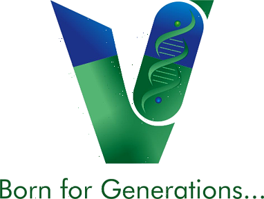

<div align="center">

  

  # **Varuta Pharma Pvt. Ltd.**
  ### *“Born for Generations...”*

  [](https://varuta.vercel.app)
  [](https://varuta.vercel.app)
  [](https://varuta.vercel.app)
  [](https://varuta.vercel.app)

  ---

</div>

## 📌 Executive Overview

**Varuta Pharma Pvt. Ltd.** is an ethical pharmaceutical & bio-nutraceutical marketing enterprise founded on **four decades of clinical research heritage**. We combine academic pharmacology with validated biological pathways to target fundamental human deficiencies.

Operating under **FSSAI Marketer License No. 13624999000034**, Varuta Pharma focuses exclusively on **100% assay-declared active formulations**. All products are manufactured in partner **WHO-GMP and ISO 22000 certified facilities** operated by **Gencleus Pharma Pvt. Ltd.** and **Peptas Pharma Pvt. Ltd.** equipped with state-of-the-art HPLC assay testing laboratories.

---

## 🔬 Core Product Portfolio (7 Published Bio-Formulations)

Every SKU in our portfolio is engineered from biological mechanism to clinical evidence grading to standardized dose:

| SKU Name | Primary Category | Key Active Ingredients & Standardized Dose | Clinical Mechanism | Format |
| :--- | :--- | :--- | :--- | :--- |
| **`GUANOLACT`** | Iron & Immunity | Bovine Lactoferrin (100mg) + Elemental Iron + Vitamin C | Enhances mucosal iron transport & intestinal transferrin saturation without GI irritation. | Caplet |
| **`ESTROCLEN`** | Women's Health | Diindolylmethane (DIM) + Indole-3-Carbinol + Calcium D-Glucarate | Favors 2-hydroxyestrone (2-OHE1) metabolite pathway to balance oestrogen ratios. | Tablet |
| **`QUICKNAP`** | Sleep & Recovery | Sublingual Melatonin (3mg) + L-Theanine (50mg) | Sublingual transmucosal delivery bypassing hepatic first-pass metabolism for fast sleep latency. | Oral Film (ODF) |
| **`FATEASE-5`** | Weight Mgmt | Garcinia Cambogia (60% HCA) + Green Coffee Extract + CLA | Inhibits ATP-citrate lyase & enhances mitochondrial fatty acid beta-oxidation. | Capsule |
| **`TELAGE`** | Cellular Longevity | Trans-Resveratrol + Coenzyme Q10 + Astragaloside IV | Activates SIRT1 and Nrf2 pathways to protect telomere length against oxidative decay. | Tablet |
| **`ERECTER`** | Men's Health | L-Arginine + Pycnogenol + Tribulus Terrestris | Potentiates endothelial nitric oxide synthase (eNOS) for microvascular perfusion. | Caplet |
| **`CYSTORIN`** | Women's Health | Myo-Inositol & D-Chiro Inositol (40:1 Ratio) + Folate | Restores follicular insulin receptor sensitivity and ovulatory regularity in PCOS. | Sachet |

---

### 📍 Office Network Address Details

- 📍 **Registered Office (Pune)**: `Flat No. B-120, Sebiyan Apartments, Street No. 2/1/1, Near Indu Lawns, Pune, Maharashtra 411046`
- 🏢 **Corporate Office (Hyderabad)**: `Varuta Pharma Pvt. Ltd., H No, Srt 283, Alwyn Housing Colony, Sanath Nagar, Hyderabad, Telangana 500018`
- 🌏 **International Office (Australia)**: `Varuta Pharma Pvt. Ltd., Suite 7.12, Level 7, 365 Little Collins St., Melbourne, VIC 3000, Australia`

---

## 🌐 Technical Architecture & Design System

The Varuta web application is built with modern frontend engineering principles:

- ⚡ **Core Framework**: React 19 + Vite 8 + TypeScript
- 🎨 **Styling Engine**: TailwindCSS v4 with custom Forest Emerald (`#0b835c`) design tokens
- 🌐 **3D Visualizations**: Three.js + @react-three/fiber + **OriginKit Interactive 3D Globe** (featuring custom land dots, latitude/longitude graticule, and multi-location markers)
- 🚀 **Routing**: React Router DOM v7 with 8 production routes (`/`, `/about-us`, `/products`, `/products/:category/:slug`, `/research-and-quality`, `/blogs`, `/blogs/:slug`, `/contact`)
- 🔒 **Regulatory Compliance**: DMR Act 1954 Schedule & FSSAI 2022 Statutory Disclosures

---

## 🛠️ Local Development & Deployment

### 1. Installation

```bash
# Clone the repository
git clone https://github.com/Romkar2006/VARUTA_PHARMACEUTICALS.git

# Navigate to the Frontend workspace
cd VARUTA_PHARMACEUTICALS/Frontend

# Install dependencies
npm install
```

### 2. Run Local Development Server

```bash
npm run dev
```
Open [http://localhost:5173](http://localhost:5173) in your browser.

### 3. Production Build

```bash
npm run build
```

---

## ⚖️ Statutory Legal & Regulatory Notice

> **MANDATORY STATUTORY REGULATORY NOTICE (FSSAI LIC. NO. 13624999000034)**  
> Nutraceutical and food supplements marketed by **Varuta Pharma Pvt. Ltd.** are manufactured by licensed WHO-GMP certified partners (**Gencleus Pharma Pvt. Ltd.** & **Peptas Pharma Pvt. Ltd.**). Products are not intended to diagnose, treat, cure, or prevent any disease. **NOT FOR MEDICAL USE.** Always consult a registered medical practitioner before starting any supplementation regimen.

---

<div align="center">
  <p>© 2026 Varuta Pharma Pvt. Ltd. All rights reserved. | <i>Born for Generations...</i></p>
</div>
